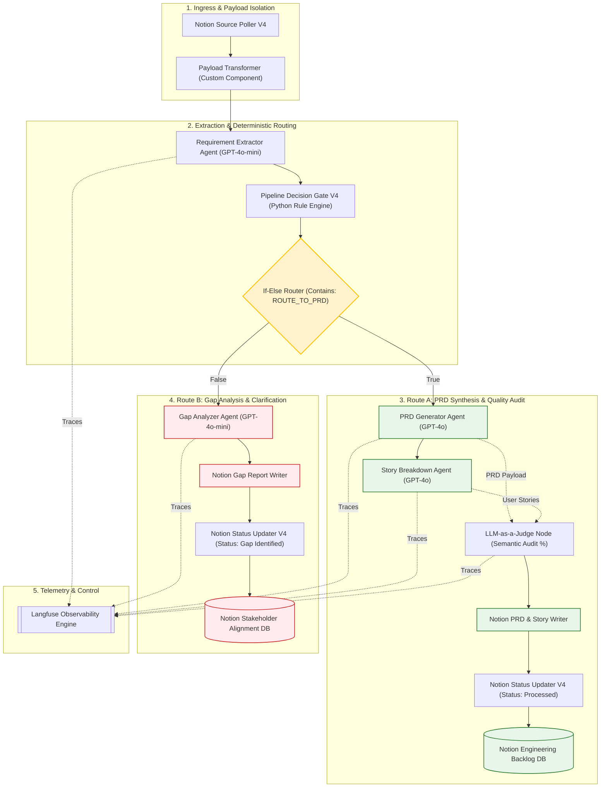

# 🧞‍♂️ PRD Genie: AI-Powered Product Documentation Assistant

[](https://github.com/neuronforge/prd-genie)
[](https://github.com/langflow-ai/langflow)
[](https://openai.com/)
[](https://langfuse.com/)
[](https://developers.notion.com/)
[](LICENSE)

> **Autonomous multi-agent pipeline converting messy meeting transcripts, stakeholder notes, and product briefs into engineering-ready PRDs, persona-based Agile backlogs, and stakeholder gap reports in under 2 minutes.**

---

## 📌 Table of Contents
- [Executive Summary](#-executive-summary)
  
- [Problem Statement & Business Impact](#-problem-statement--business-impact)
  
- [System Architecture (HLD & LLD)](#-system-architecture-hld--lld)
  
- [Key Features & Capabilities](#-key-features--capabilities)
  
- [Multi-Agent Pipeline & Routing Logic](#-multi-agent-pipeline--routing-logic)
  
- [Tech Stack & Model Tiering Strategy](#-tech-stack--model-tiering-strategy)
  
- [Performance & Business ROI (KPIs)](#-performance--business-roi-kpis)
  
- [Repository Structure](#-repository-structure)
  
- [Quick Start & Setup Guide](#-quick-start--setup-guide)
  
- [Environment Variables Configuration](#-environment-variables-configuration)
  
- [License & Attribution](#-license--attribution)

---

## Executive Summary

**Project PRD Genie** is an enterprise-grade agentic workflow developed for **NeuronForge Technologies**. It solves the universal product development bottleneck: manual, slow, and inconsistent translation of unstructured meeting notes into actionable technical documentation.

PRD Genie ingests raw text inputs from Notion, runs static logical extraction, routes inputs deterministically through high-reasoning LLMs, audits story-to-PRD alignment via an independent `LLM-as-a-Judge` agent, and automatically publishes standardized PRDs, MoSCoW-prioritized backlog stories, or Gap Clarification Reports directly into target Notion databases.

---

## 🔴 Problem Statement & Business Impact

Internal assessments at NeuronForge revealed critical software development lifecycle (SDLC) bottlenecks:
1. **High Manual Overhead:** Product Managers (PMs) and Technical Program Managers (TPMs) spend **8+ hours per document** manually digesting notes, writing PRDs, and creating Agile user stories.
2. **Format Inconsistency:** Varied document structures across PMs lead to downstream estimation friction for engineering leads.
3. **Information Leakage:** Vital requirements discussed in meetings remain trapped in transcripts and local files.
4. **AI Scope Fabrication Risks:** Naive single-prompt AI tools often hallucinate non-existent features or alter numerical technical specifications (e.g., rounding `200ms at p95` to `200ms`).

### 🎯 Business Solution & Impact
* **90% Productivity Boost:** Drops Time-to-PRD from **8+ hours to < 30 minutes** (pipeline execution `< 120s`).
* **100% Structural Standardization:** Enforces uniform, engineering-approved PRD and Agile story schemas.
* **Zero-Hallucination SLA:** Strict prompt guardrails enforce verbatim capture of numerical metrics and technical boundaries.

---

## 🏗️ System Architecture (HLD & LLD)

PRD Genie employs a decoupled 5-tier architecture spanning Ingress, Deterministic Routing, Multi-Agent Generation, Automated Quality Auditing, and Bidirectional Database Sync.

### High-Level Design (HLD)


# Logical Workflow 

[ Notion Ingestion Queue DB ]
             │ (Row Status: "Pending")
             ▼
 [ Notion Source Poller V4 ] ──► [ Payload Transformer ]
                                          │
                                          ▼
                         [ Node 1: Requirement Extractor ] (GPT-4o-mini)
                                          │
                                          ▼
                      [ Node 1.5: Pipeline Decision Gate V4 ]
                                          │
                  ┌───────────────────────┴───────────────────────┐
                  ▼ (Route A: Clean)                              ▼ (Route B: Ambiguous/Contradiction)
        [ Node 2: PRD Generator ]                       [ Node 2b: Gap Analyzer ] (GPT-4o-mini)
               (GPT-4o)                                           │
                  │                                               ▼
                  ▼                                   [ Notion Gap Report Writer ]
       [ Node 3: Story Breakdown ]                                │
               (GPT-4o)                                           ▼
                  │                                  [ Notion Status Updater V4 ]
                  ├───────────────────────┐             (Status: "Gap Identified")
                  ▼                       │                       │
     [ Node 3.5: LLM-as-a-Judge ] ◄───────┘                       ▼
     (Alignment Score & Audit %)                     [ Notion Stakeholder Alignment DB ]
                  │
                  ▼
   [ Notion PRD & Story Writer ]
                  │
                  ▼
     [ Notion Status Updater V4 ] (Status: "Processed")
                  │
                  ▼
  [ Notion Engineering Backlog DB ]
```

### Low-Level Execution Sequence (Mermaid LLD)



---

## ✨ Key Features & Capabilities

1. **Automated Background Ingestion (`Notion Source Poller V4`):** Polls Notion workspace databases for `Pending` rows, extracting raw meeting transcripts, documents, and row metadata without manual file uploading.
2. **Schema-Validated Requirement Extractor (`Node 1`):** Ingests raw text and performs static analysis to extract metadata, functional requirements, non-functional requirements (NFRs), stakeholders, deadlines, unstated assumptions, and explicit logical contradictions.
3. **1-Wire Pipeline Decision Gate (`Decision Gate V4`):** Pure Python custom component that inspects top-level and nested `is_ambiguous` requirement flags and `contradiction_detected` objects, prepending `__ROUTE_DECISION: ROUTE_TO_PRD__` (or `ROUTE_TO_GAP`) to pass payload and routing tag through a single wire.
4. **Zero-Hallucination PRD Generator (`Node 2`):** Merges extracted requirements into a standardized Markdown PRD template covering Overview, Goals, Personas, Features, MoSCoW Priorities, NFRs, and Open Questions.
5. **Persona-Segmented Story Breakdown (`Node 3`):** Deconstructs PRD features into granular Agile user stories formatted in standard `As a [Persona], I want [action] so that [benefit]` syntax with Given-When-Then acceptance criteria checklist items.
6. **Automated Semantic Alignment Judge (`Node 3.5`):** Independent LLM-as-a-Judge node that audits story-to-PRD coverage, checks for scope drift ("phantom stories"), and outputs a quantitative **Alignment Score (%)** and audit remarks.
7. **Extended Gap Analyzer (`Node 2b`):** Triggers when ambiguous or contradictory inputs are detected. Halts PRD creation and outputs a structured Gap Report with **Readiness Status (RED/YELLOW/GREEN)** and role-grouped clarification questions (PM, Engineering, UX, Sales).
8. **Bidirectional State Synchronization (`Notion Status Updater V4`):** Automatically updates Notion Ingestion Queue row status from `Pending` to **`Processed`** (Route A) or **`Gap Identified`** (Route B) with page URL references.

---

## ⚡ Tech Stack & Model Tiering Strategy

| Layer | Technology / Tool | Selection Rationale |
| :--- | :--- | :--- |
| **Workflow Engine** | **Langflow 1.0+** | Rapid visual prototyping of sequential multi-agent pipelines with exportable JSON configuration management. |
| **Lightweight LLM** | **OpenAI GPT-4o-mini** | Low-cost, low-latency extraction (Node 1) and gap reporting (Node 2b). Handles 70%+ of total token volume. |
| **High-Reasoning LLM**| **OpenAI GPT-4o** | Reserved strictly for high-fidelity PRD compilation (Node 2) and Agile user story breakdown (Node 3). |
| **Judge Model** | **Meta Llama 3.3 70B / OpenRouter** | Independent model used in Node 3.5 to prevent self-preference bias during story alignment evaluation. |
| **Observability** | **Langfuse** | Native nested execution tracing, tracking latency, token usage, and cost per node. |
| **Integration / Sinks**| **Notion API v4 (Custom Python)** | Workspace collaboration hub for PM/Engineering handoffs. |

### 💰 Cost Optimization (Multi-LLM Tiering)
* **Token Budgeting:** GPT-4o-mini processes extraction for ~$0.0012/run. GPT-4o handles synthesis for ~$0.040/run.
* **Average Cost per Pipeline Run:** **$0.045 – $0.050 USD** (saves ~75% compared to single-model GPT-4o pipelines @ $0.18/run).

---

## 📊 Performance & Business ROI (KPIs)

| Metric | Target SLA | Verified Result (12-Input Test Dataset) | Status |
| :--- | :--- | :--- | :---: |
| **Time-to-PRD** | < 30 minutes | **< 2 minutes end-to-end execution** | 🟢 PASS |
| **Template Adherence** | 100% | **100% compliance** with standard PRD schema | 🟢 PASS |
| **Data Grounding SLA** | 100% (0% Hallucination) | **100% grounded**; 0 invented features | 🟢 PASS |
| **Verbatim Technical Spec SLA**| 100% exact retention | **100% verbatim capture** (no metric rounding) | 🟢 PASS |
| **Decision Gate Accuracy** | 100% deterministic | **100% routing accuracy** across test suite | 🟢 PASS |
| **Story Alignment Score** | $\ge$ 90% average | **95.8% average alignment score** | 🟢 PASS |
